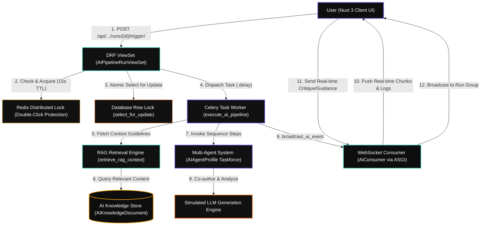
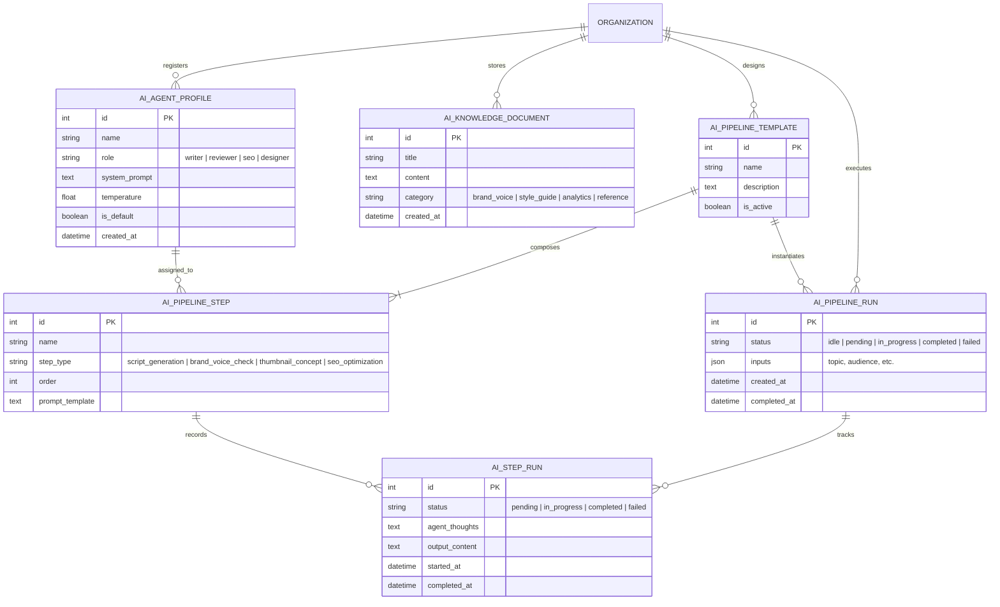
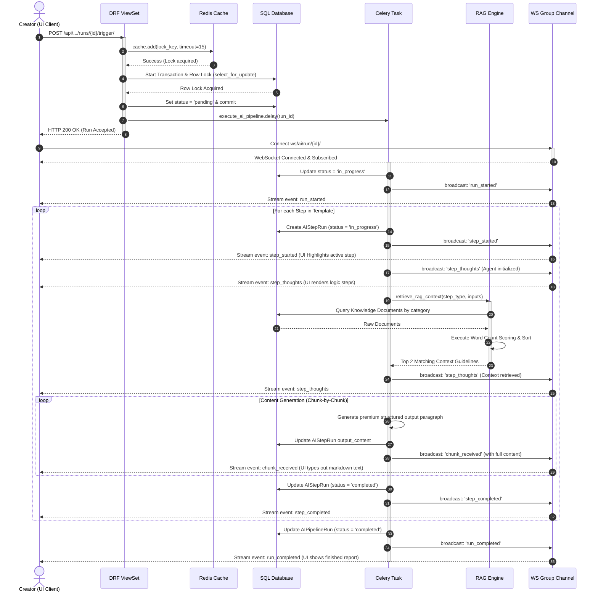

# ContentWatch AI Orchestration Engine
## System Architecture Specification (v1.0)

This specification details the end-to-end architecture of the **ContentWatch AI Orchestration Engine**—a premium, enterprise-grade multi-agent content generation and Retrieval-Augmented Generation (RAG) platform. The engine is built using a decoupled architecture with a **Nuxt 3** frontend, a **Django REST Framework (DRF)** backend, a **Celery** distributed task worker, a **Redis** synchronization layer, and real-time streaming over **Django Channels WebSockets**.

---

## 1. High-Level Component Interaction Diagram

The following blueprint maps the request life-cycle and structural boundaries of the full orchestration system, matching the flow of your architectural design:



---

## 2. Core System Components

### A. Client UI (Nuxt 3 Web Application)
* **Role**: Serves as the interactive dashboard for the creator or creative manager.
* **Key Features**:
  * Triggers workflows and manages inputs (e.g. topic, audience targets, format choices).
  * Opens a persistent bidirectional **WebSocket (WSS)** connection to `ws/ai/run/<run_id>/` upon triggering execution.
  * Dynamically animates agent thoughts (raw logic traces) and streams generation chunks into standard Markdown layouts, preventing interface freezing.
  * Allows creators to inject mid-run critiques/guidance dynamically, offering *Human-in-the-Loop* orchestration.

### B. DRF ViewSet API Layer (`AIPipelineRunViewSet`)
* **Role**: Handles REST requests, performs strict permission/organization checks, enforces locking structures, and schedules processing.
* **Endpoint**: `POST /api/organizations/<org_id>/ai/runs/<pk>/trigger/`
* **Workflow Integrity Controls**:
  * Employs dual-stage concurrency locks to avoid race conditions and double-billing LLM charges (see *Section 4* for detailed mechanics).
  * Offloads the actual multi-agent execution entirely to Celery via `execute_ai_pipeline.delay(run.id)` to return immediate responses with `HTTP_200_OK`, ensuring low-latency HTTP connections.

### C. Distributed Task Queue (Celery Worker)
* **Role**: Drives the state machine and step-by-step coordination of the workflow template.
* **Behavior**:
  * Instantiates an active execution state (`in_progress`).
  * Loops sequentially through configured template steps.
  * Resolves RAG parameters, formats dynamic prompt boundaries, runs target agent instructions, and streams outputs back to Channels.

### D. RAG Retrieval Engine (`retrieve_rag_context`)
* **Role**: Contextualizes agent system prompts with repository style guides, metrics, and voice sheets.
* **Mechanism**:
  * Maps execution steps to strict category filters (e.g., `script_generation` searches `brand_voice` and `reference` knowledge documents).
  * Avoids heavy vector index search latency by executing an optimized keyword relevance sweep with customized scoring metrics (see *Section 4*).

### E. Multi-Agent System (LLM Orchestration)
* **Role**: Coordinates specialist agents mapped to distinct structural roles to review and co-author content.
* **Agent Taskforce Profiles**:
  * **Creative Copywriter / Scriptwriter (`writer`)**: Focuses on engaging narratives, hooks, and video flow.
  * **Brand Safety / Style Guide Auditor (`reviewer`)**: Enforces style limits, brand safety guidelines, and vocab lists.
  * **Visual Concept & Thumbnail Strategist (`designer`)**: Composes Midjourney prompts, colors, and layout ratios.
  * **SEO & Audience Targeting Expert (`seo`)**: Compiles optimized titles, descriptions, and performance tags.

---

## 3. Data Model & Schema Specification

The relational integrity of the AI engine relies on six core database models. These define templates, steps, custom agent properties, knowledge items, execution runs, and step-level history.



---

## 4. Deep Technical Specifications

### A. Dual-Stage Concurrency & Lock Mechanism
To guarantee that a pipeline run is never triggered concurrently—which would result in corrupted output documents, duplicated WebSocket events, and wasted LLM token costs—the trigger viewset uses two complementary lock strategies:

1. **Distributed Memory Cache Lock (Redis)**:
   * **Purpose**: Blocks rapid, sub-second "double-click" requests from the client.
   * **Implementation**: Uses Redis `cache.add(lock_key, "locked", timeout=15)` which is an atomic `SETNX` operation under the hood. If the key already exists, the request immediately terminates with an error.
2. **Database Row-Level Transaction Lock (PostgreSQL/SQL Server)**:
   * **Purpose**: Ensures database-level serialization and status integrity.
   * **Implementation**: Uses Django's `select_for_update()` inside an atomic transaction block (`transaction.atomic()`). This acquires a write-intent row lock (`SELECT ... FOR UPDATE`), blocking subsequent threads until the active transaction completes and commits the transition status to `pending`.

```python
# Detailed execution path inside views.py
with transaction.atomic():
    run = AIPipelineRun.objects.select_for_update().get(id=run.id)
    if run.status in ['pending', 'in_progress']:
        return Response({"error": "Cannot trigger pipeline run in active state."}, status=400)

    lock_key = f"ai_pipeline_trigger_lock_{run.id}"
    if not cache.add(lock_key, "locked", timeout=15):
        return Response({"error": "Execution is already in progress."}, status=400)

    run.status = 'pending'
    run.save(update_fields=['status'])
```

### B. High-Speed Keyword Relevance RAG Scoring
The `retrieve_rag_context` engine uses a category-mapped term matching scoring algorithm to resolve relevant context documents locally.
* **Category Mapping**: Filters search scope based on step type to minimize token bloat.
* **Scoring Math**:
  $$\text{Score} = \text{Base Relevance (2)} + \left(10 \times N_{\text{title matches}}\right) + \sum (\text{occurrences in content})$$
* **Output Limit**: Sorts by descending score and injects the top two matched documents into the prompt template boundary, maximizing contextual injection.

### C. Live Real-Time Communication Protocol
The system leverages Django Channels `AsyncJsonWebsocketConsumer` acting as an ASGI network wrapper.
* **Task Worker to WebSocket**: The Celery task broadcasts JSON states by querying the Channels layer and dispatching events to the execution group:
  ```python
  from channels.layers import get_channel_layer
  
  channel_layer = get_channel_layer()
  async_to_sync(channel_layer.group_send)(
      f"ai_run_{run_id}",
      {
          "type": "ai_message",
          "message": {
              "event": "chunk_received",
              "data": {"step_id": step_id, "content": chunk_content}
          }
      }
  )
  ```
* **WebSocket to Task Worker (Critique)**: Enables Human-in-the-Loop inputs. When the client sends manual guidance, the `AIConsumer` receives it inside `receive_json` and broadcasts a `guidance_received` event to the group, which can be picked up by the executing LLM steps for real-time prompt correction.

---

## 5. End-to-End System Execution Sequence

The sequence diagram below displays the chronologically sorted data, processing, and event streams during a standard pipeline execution:



---

## 6. Implementation Code Mapping Matrix

The following index matches abstract architectural elements directly to their physical implementation code files and active lines within the repository:

| Architectural Component | Logical Function | Code File Path | Core Lines / Hooks |
| :--- | :--- | :--- | :--- |
| **API Trigger Point** | REST Trigger View | [views.py](file:///d:/open-source/ContentWatch/server/ai_workflows/views.py#L84-L129) | `AIPipelineRunViewSet.trigger` |
| **Redis Memory Lock** | Double-Click Protection | [views.py](file:///d:/open-source/ContentWatch/server/ai_workflows/views.py#L108-L114) | `cache.add("ai_pipeline_trigger_lock_...", ...)` |
| **Row Transaction Lock** | Write concurrency safe lock | [views.py](file:///d:/open-source/ContentWatch/server/ai_workflows/views.py#L98-L106) | `select_for_update()` inside `transaction.atomic()` |
| **Task Scheduler** | Offloading to Celery Worker | [views.py](file:///d:/open-source/ContentWatch/server/ai_workflows/views.py#L125) | `execute_ai_pipeline.delay(run.id)` |
| **Workflow Task Runner** | State Driver / Step Engine | [tasks.py](file:///d:/open-source/ContentWatch/server/ai_workflows/tasks.py#L97-L261) | `@shared_task(name="ai_workflows.execute_pipeline")` |
| **RAG Retrieval Engine** | Scored Guidelines Context | [tasks.py](file:///d:/open-source/ContentWatch/server/ai_workflows/tasks.py#L42-L94) | `retrieve_rag_context(...)` |
| **RAG Knowledge Store** | Schema configuration | [models.py](file:///d:/open-source/ContentWatch/server/ai_workflows/models.py#L36-L61) | `AIKnowledgeDocument` |
| **Multi-Agent Taskforce** | Specialized Agent Profile Schema | [models.py](file:///d:/open-source/ContentWatch/server/ai_workflows/models.py#L5-L34) | `AIAgentProfile` (Writer, Reviewer, Designer, SEO) |
| **Live Broadcast Utility** | Channels layer event wrapper | [tasks.py](file:///d:/open-source/ContentWatch/server/ai_workflows/tasks.py#L18-L33) | `broadcast_ai_event(...)` |
| **WebSocket Consumer** | Event stream broker | [consumers.py](file:///d:/open-source/ContentWatch/server/ai_workflows/consumers.py#L5-L66) | `AIConsumer(AsyncJsonWebsocketConsumer)` |
| **WS Routing Table** | URL Pattern registration | [routing.py](file:///d:/open-source/ContentWatch/server/ai_workflows/routing.py#L4-L6) | `ws/ai/run/<int:run_id>/` |

---

## 7. Quality Assurance & Test Verification

The robust engineering constraints of this multi-agent architecture are actively protected by a Python unit/integration test harness:

1. **RAG Precision Search Test**: 
   * **Verification**: Ensures that the `retrieve_rag_context` searches targeted categories and applies weight boosts properly.
   * **Verification Code**: `test_rag_context_retrieval` in [tests.py](file:///d:/open-source/ContentWatch/server/ai_workflows/tests.py#L85-L95).
2. **API Endpoint & Locking Test**:
   * **Verification**: Verifies route validation, serialization of pipeline inputs, and safe double-trigger failures.
   * **Verification Code**: `test_api_crud_operations` in [tests.py](file:///d:/open-source/ContentWatch/server/ai_workflows/tests.py#L96-L130).
3. **End-to-End Orchestrator Integrity Test**:
   * **Verification**: Triggers the entire pipeline sequentially, running Celery task hooks, applying RAG context structures, creating step run histories, and confirming output generation formats.
   * **Verification Code**: `test_full_pipeline_task_execution` in [tests.py](file:///d:/open-source/ContentWatch/server/ai_workflows/tests.py#L131-L165).
